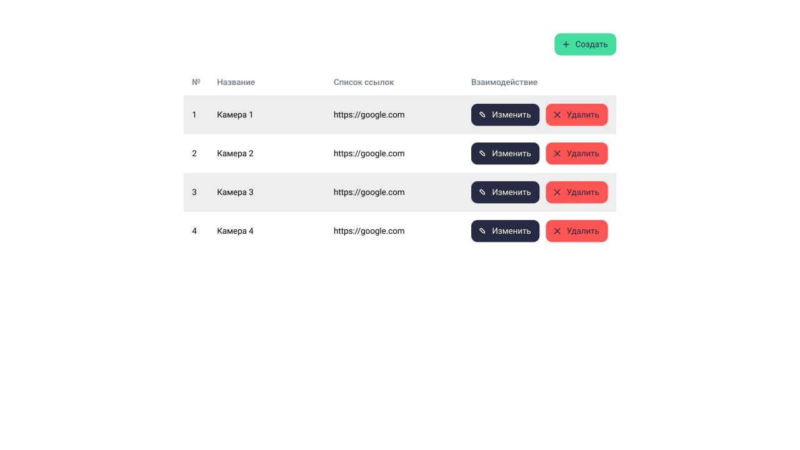
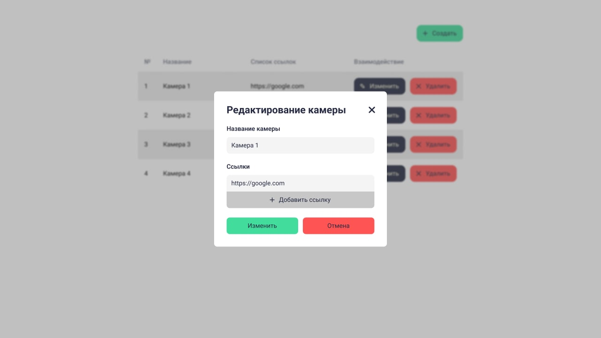
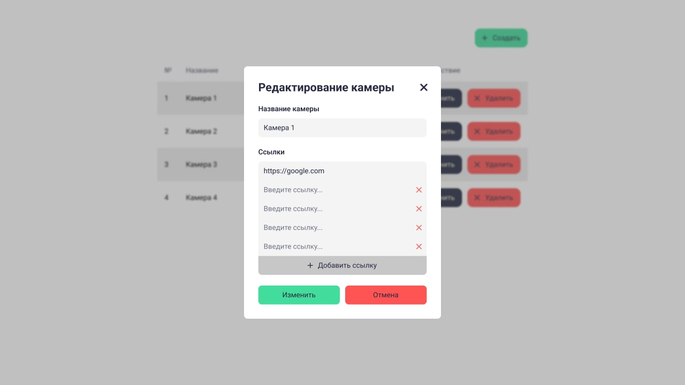

# Описание переходов по страницам

По умолчанию должна открываться [страница просмотра](#Просмотр)

### Просмотр
По нажатию на кнопку "добавить" должно открываться модальное окно [создания](#Создание)

По нажатию на кнопку "изменить" должно открываться модальное окно [редактирования](#Редактирование) камеры, на строке которой расположена кнопка

По нажатию на кнопку "Удалить" камера, на строке которой расположена кнопка, должна исчезнуть

Макет Страницы просмотра 

### Создание
По нажатию кнопки "отмена" должно закрываться модальное окно

По нажатию кнопки "сохранить" должно закрываться модальное окно и обновиться таблица с созданной камерой

Макеты Модального окна создания

### Редактирование

По нажатию кнопки "отмена" должна открываться страница [просмотра](#Просмотр)

По нажатию кнопки "Изменить" должно закрываться модальное окно и обновиться таблица с измененной камерой

Макеты Модального окна Редактирования

